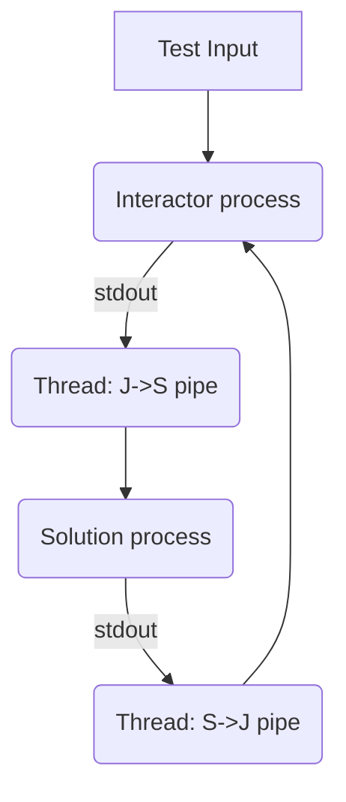

# Platform Architecture & Internals

Deep dive into the underlying engineering choices, execution isolation, and process management of `kjudge`.

## 1. Process Execution & Subprocess Mechanics

The core functionality of `kjudge` relies on Python's `subprocess` subsystem tightly coupled with `time.perf_counter` for rigorous, sub-millisecond execution control.

When a solution is passed to the runner, `kjudge` evaluates:
- **`subprocess.run` encapsulation:** Output is intercepted completely via `subprocess.PIPE`. This mitigates blocking anomalies caused by poorly formulated I/O buffers in C++ (like a missing `std::flush` or `std::endl`).
- **Clock Drift and Grace Buffering:** While users input max timeouts like `2000ms`, the subprocess executes with an artificial upper threshold of `timeout_sec + 0.5`. This prevents Python's interrupt loop from incorrectly flagging processes that take exactly `2000.01ms` due to OS scheduling thrash, leaving accurate TLE attribution to internal wall-clock measurements instead.

## 2. Interactive Processes Architecture

Interactive problems present a unique technical hurdle. The solution and judge interactor are inherently mutually blocking; `kjudge` handles this via daemonized threading bridges.

If one pipe drops early (Broken Pipe / OSError), the threads cleanly terminate via context suppression instead of crashing the executor stack.

## 3. Storage Hierarchy

kJudge aggressively denormalizes state to optimize for speed. 
Data is fragmented across scopes:
1. **Global Immutable Rules:** Cached at `~/.kjudge/config.json`.
2. **Volatile Test Data:** Persisted per-directory in `.kjudge/tests/`.
3. **Execution Artifacts:** Retained within `.kjudge/last_run/` ensuring that Diff-Views run in `O(1)` time by retrieving the artifact directly, rather than rerunning the computational container.
